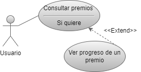
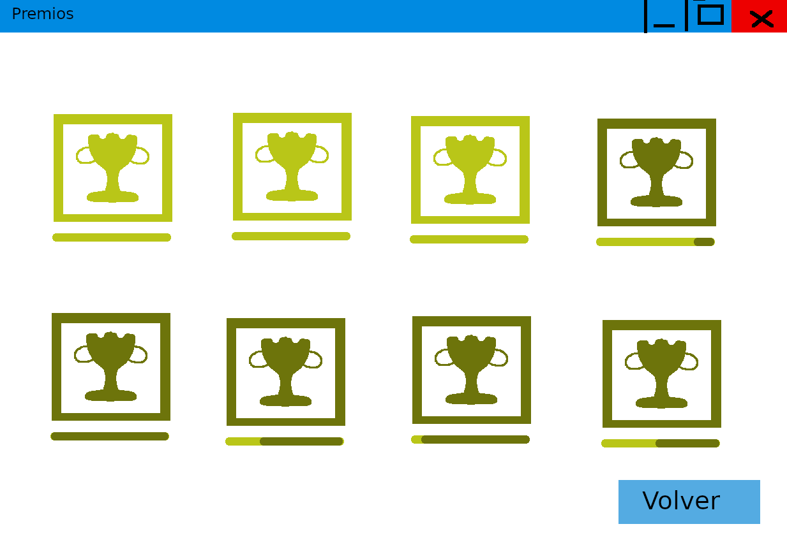

# Funcionalidad 6
### Diego Esteban Briongos
---

---
## Nombre

Premios

---
## Descripción

Al finalizar la partida se comprobará si ha dado lugar a la
consecución de un premio.

---

## Actores
* Usuario

---

## Precondiciones
* El usuario se ha identificado
---

## Requisitos no funcionales

Como mínimo tiene que haber estos tipos de premios:

* Premio por superar n veces un nivel concreto.
* Premio por ganar n partidas seguidas.
---

## Flujo de eventos
1. El usuario pulsa el botón "Premios" desde el menú. (ilustración 1)
2. Se muestran los premios obtenidos y por obtener. (ilustración 2)
    * Si Pincha sobre un premio sin obtener.
    1. Se muestra el progreso en el premio elegido, y la descripción para saber como obtenerlo. (ilustración 3)
        * Si hace click en "volver".
        1. se vuelve a la lista de premios.
---

## Poscondiciones

Ninguna.

---

## Interfaz gráfica

ilustración 1. Menú principal

ilustración 2. Menú de premios

ilustración 3. Descripción de premio

---
